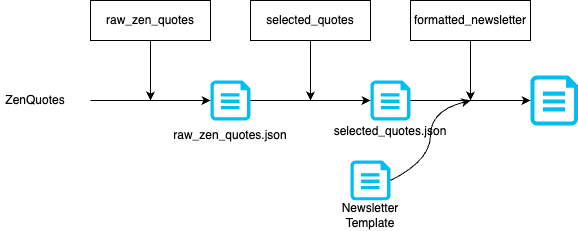

# 🧘 Zen Quote Newsletter Pipeline

## Overview
An automated data pipeline built with **Apache Airflow** on **Astronomer** that fetches daily 
zen quotes from a public API, selects the most meaningful ones, and generates a formatted 
newsletter — all orchestrated through Airflow 3's asset-based scheduling.

---

## Architecture
